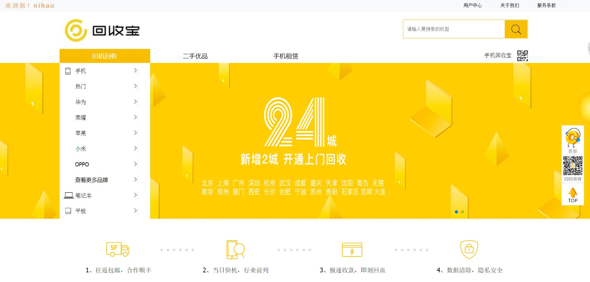

# 回收宝的网站
 
## 项目运行
- 安装依赖包
	- npm install 
- 项目运行
	- node app

## npm初始化
	- 为什么初始化npm  因为咱们会依赖一下npm的包
	- npm是一个包管理工具
## 入口文件

## 路由
- var router = express.Router(); 调用express框架里面的一个路由的方法
- router上面的方法 get post put ..... 
-第二个函数是一个函数，函数有三个参数
- 第一参数：req请求的信息
	- req.query 请求过来的参数
- 第二参数：res相应的信息
	- res.send 发送信息的
- 第三个参数：继续执行下一步

## 静态文件

## 团队协作流程

## git建立远程仓库

## 建立一个新的分支

## 新人拉取我项目下来后 是不是要 
- 安装咱们的依赖包 npm install
- node app
- 访问对应的服务

## git合并

## http是无状态的

## session
- 后台hi产生一个sessionid
 - session 写入到内存中，在把sessionid写入到cookie传递给前端
当你访问每个页面的时候都会从cookie里拿这个sessionid去和内存里面的作对比，如果一样就是一个用户

## 跨域

同源策略
两个页面的协议，端口（如果有指定）和域名都相同，则两个页面具有相同的源

http:www.baidu.com:8080/a/b

http 协议
www.baidu.com 域名
8080端口

www.baidu.com
baidu.com

baidu.com:80
a.baidu.com

b.baidu.com

## 跨域
 - jsonp script引入然后加一个callback方法
 - script可以引入不同域名下文件
 - \
 - abc({code:1,msg:'sucess'})
 - function abc(data) {}
 - cors 操作都在后台： 后台改变请求头
 

## 做的功能
- user 
    - 登录
    - 注册
    - 退出
    - 修改密码
    - 展示信息
- search
    - 完全匹配名字才能搜索到，以后加入模糊查询
- shop
    - 侧边栏
- banner
    - 轮播图效果
- shop2
    - 切换效果
- news
    - 新闻列表
    - 新闻页
    -热点新闻
- link
    - 合作伙伴
    
    

 
 
 
 
 
 
 
 
 
 
 

